# 🛒 Fresh Mart

A full-stack Django-based e-commerce web application for selling fresh fruits and vegetables online.  
Fresh Mart provides a seamless shopping experience for users along with a complete vendor management system, including cart handling, secure payments, and order processing.

This project demonstrates end-to-end web application development along with cloud deployment on AWS EC2 using Nginx and Gunicorn.

## 🚀 Tech Stack

[](https://aws.amazon.com/ec2/)
[](https://ubuntu.com/)
[](https://www.python.org/)
[](https://www.djangoproject.com/)
[](https://gunicorn.org/)
[](https://nginx.org/)
[](https://razorpay.com/)

- **Backend:** Django, Python  
- **Frontend:** HTML, CSS, Bootstrap  
- **Database:** SQLite / PostgreSQL  
- **Payment Gateway:** Razorpay  
- **Cloud Deployment:** AWS EC2  
- **Web Server:** Nginx + Gunicorn

## 🏗 Architecture

```text
Internet Client
      │
      ▼
   Nginx
(Reverse Proxy)
      │
      ▼
  Gunicorn
 (WSGI Server)
      │
      ▼
Django Fresh Mart Application
      │
      ▼
Database (SQLite / PostgreSQL)
```

Flow Explanation:

Client sends request from browser
Nginx handles incoming traffic and static files
Gunicorn processes Django application requests
Django handles business logic (cart, orders, payments)
Database stores user, product, and order data

## ⚙️ Features & Deployment Highlights

### 👤 User Features
- Secure user authentication (login & registration)
- Browse fresh fruits and vegetables by category
- Add products to cart and manage quantities
- Place orders with a smooth checkout flow
- View order history and track status

### 🏪 Vendor / Admin Features
- Add, update, and delete products
- Manage stock and inventory
- View and process customer orders

### 💳 Payment Integration
- Integrated Razorpay payment gateway
- Secure transaction handling
- Order confirmation after successful payment

### ☁️ Deployment Highlights
- Deployed on AWS EC2 Ubuntu instance
- Configured Gunicorn as WSGI server
- Nginx used as reverse proxy for production
- Static files served efficiently in production setup

# 📸 FreshMart - Application Screenshots

---

## 1. Index / Welcome + Login Page

| Screenshot | Description |
|------------|-------------|
| 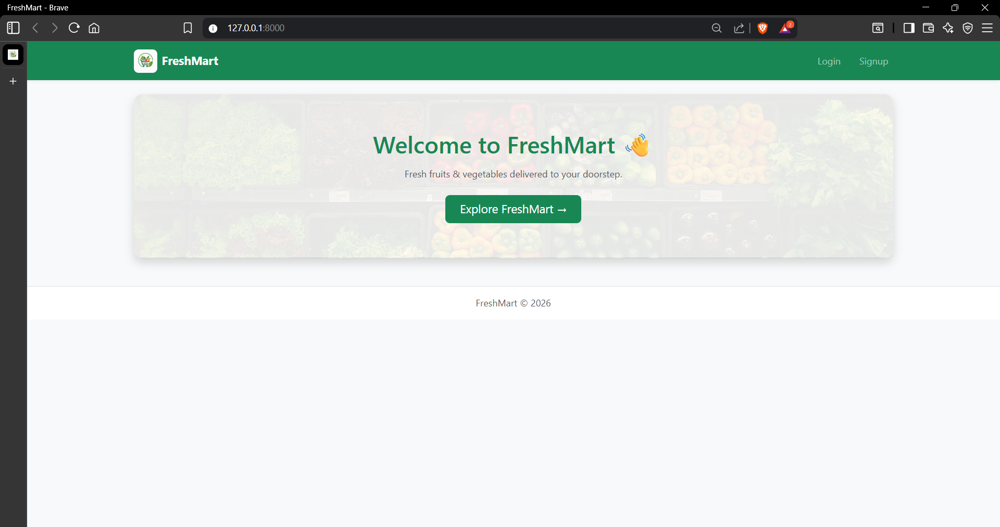 | Landing page displaying FreshMart branding and introductory tagline |
| 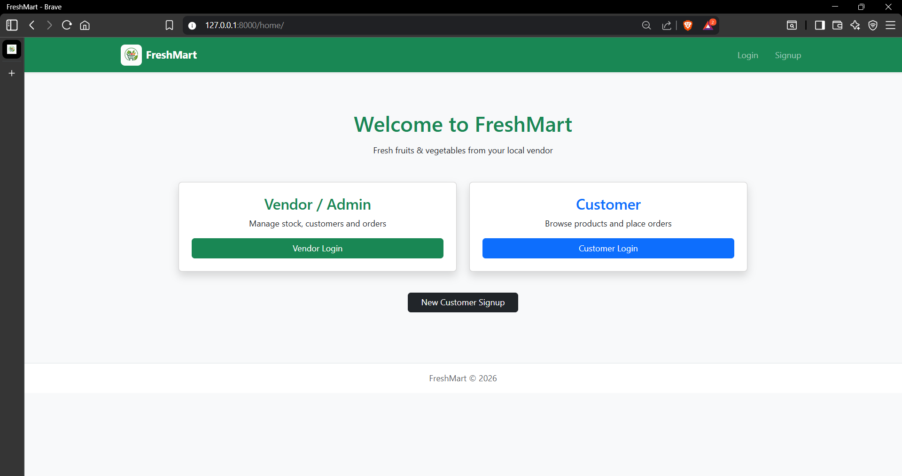 | Secure login interface where users/vendors authenticate using email/phone and password |

---

## 2. Customer Section

| Screenshot | Description |
|------------|-------------|
| 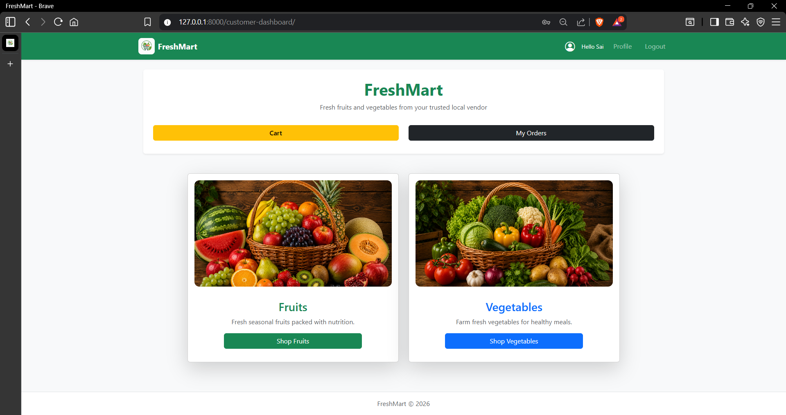 | Customer dashboard showing product categories, banners, and promotions |
| 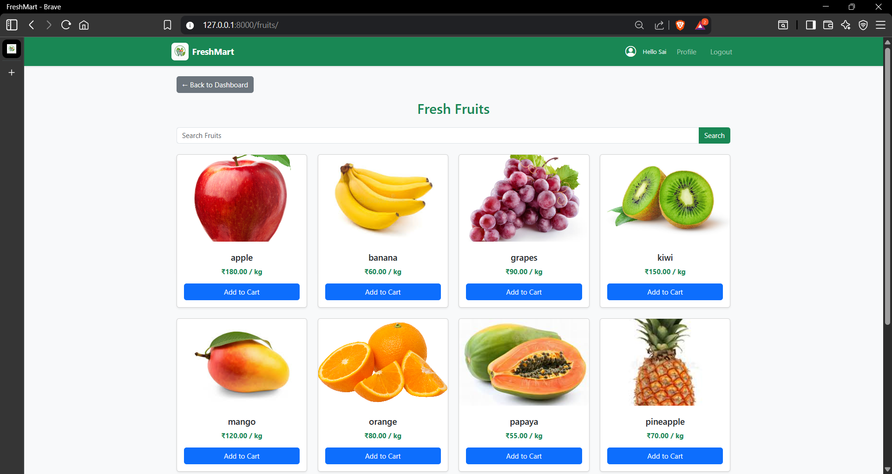 | Fruits section displaying product grid with pricing and Add to Cart option |
| 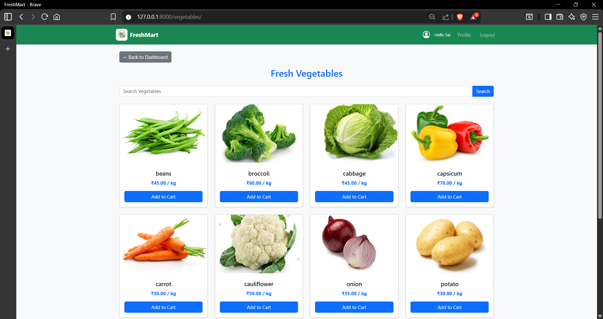 | Vegetables section with searchable product listings and cart actions |
| 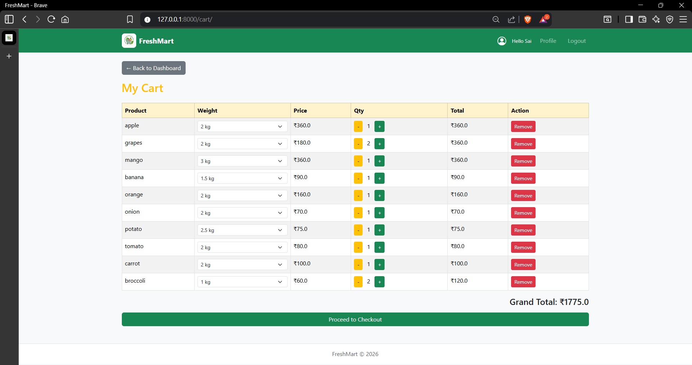 | Shopping cart view with selected items, quantity controls, and price updates |
| 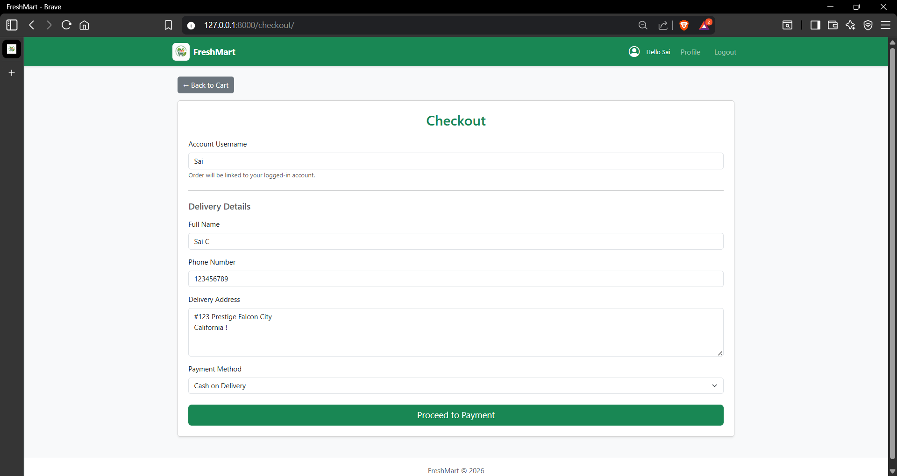 | Checkout page with address selection, order summary, and payment options |
| 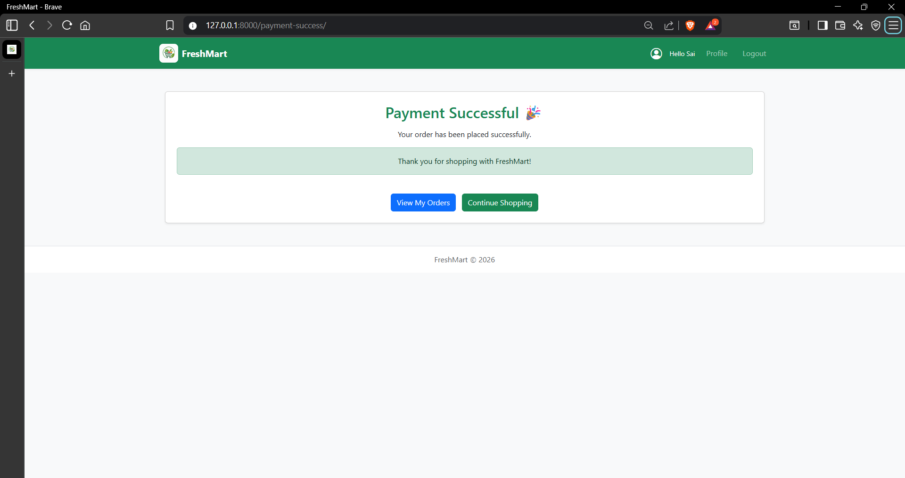 | Order confirmation page showing successful purchase and order ID |
| 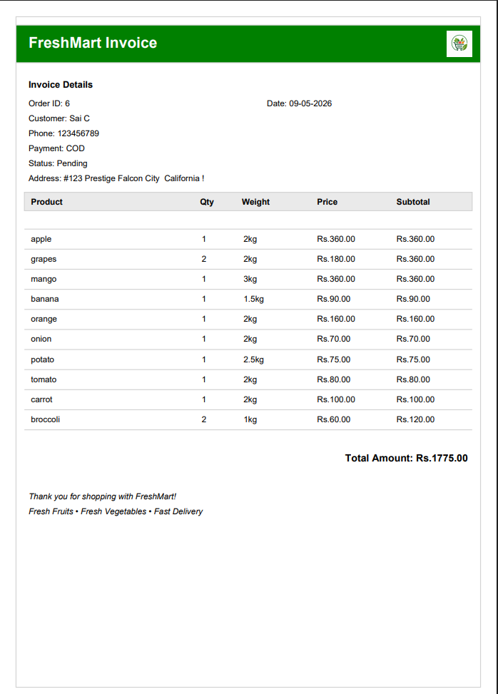 | Detailed invoice with purchased items, quantities, and total billing amount |

---

## 3. Vendor Section

| Screenshot | Description |
|------------|-------------|
| 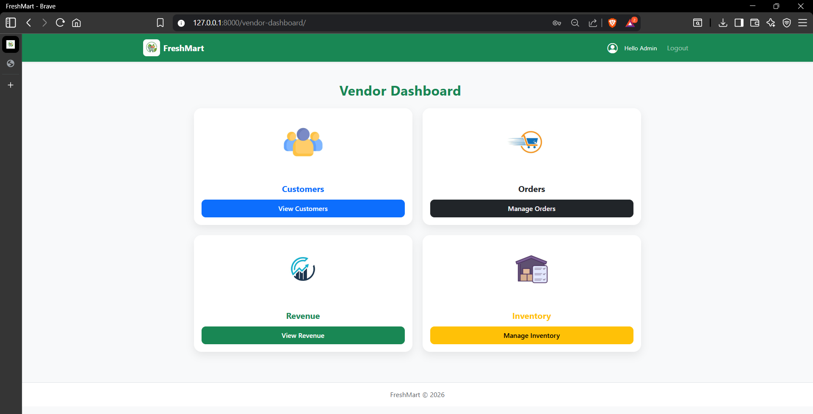 | Vendor dashboard showing sales overview and key business metrics |
| 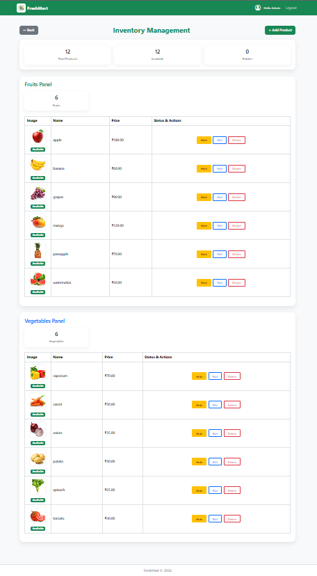 | Product management panel for adding, editing, and deleting items |
| 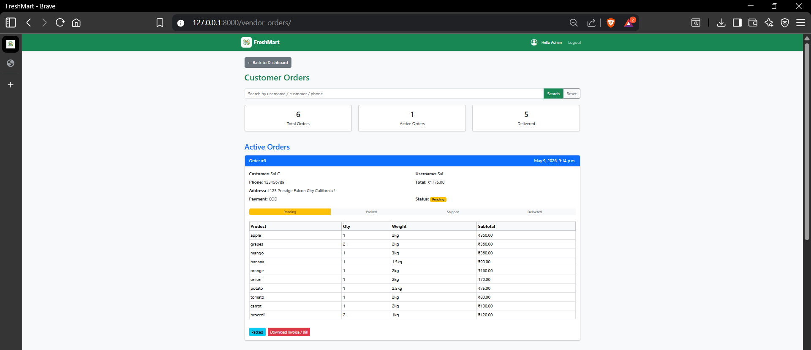 | Order management panel for tracking and updating order status |
| 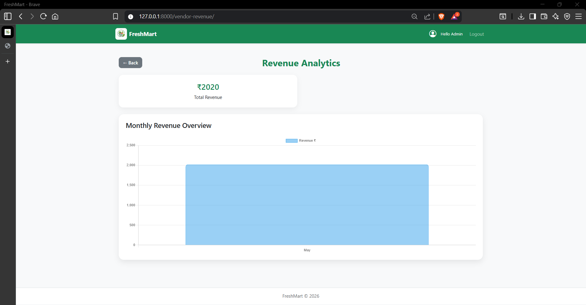 | Revenue analytics dashboard displaying monthly earnings trends |

---

## 📁 Note
All screenshots are stored in the `/Snapshots` directory of this repository.

> 📁 All screenshots are stored in the `/screenshots` directory of this repository.

## 👨‍💻 Project Summary

Fresh Mart is a full-stack e-commerce platform built to simulate a real-world online grocery store.  
It demonstrates strong backend development using Django along with practical implementation of payment gateways and cloud deployment.

This project highlights:
- End-to-end web application development
- Real-time order and inventory management system
- Secure payment integration using Razorpay
- Production deployment on AWS using EC2, Nginx, and Gunicorn

Overall, Fresh Mart reflects practical skills in building, deploying, and managing a scalable web application in a cloud environment.
